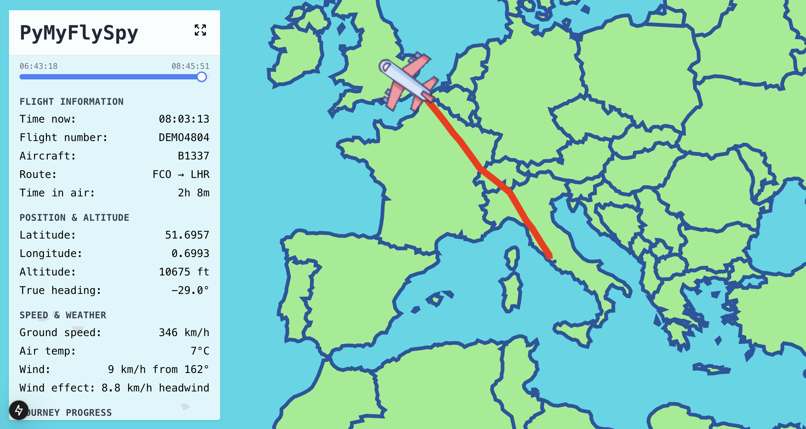
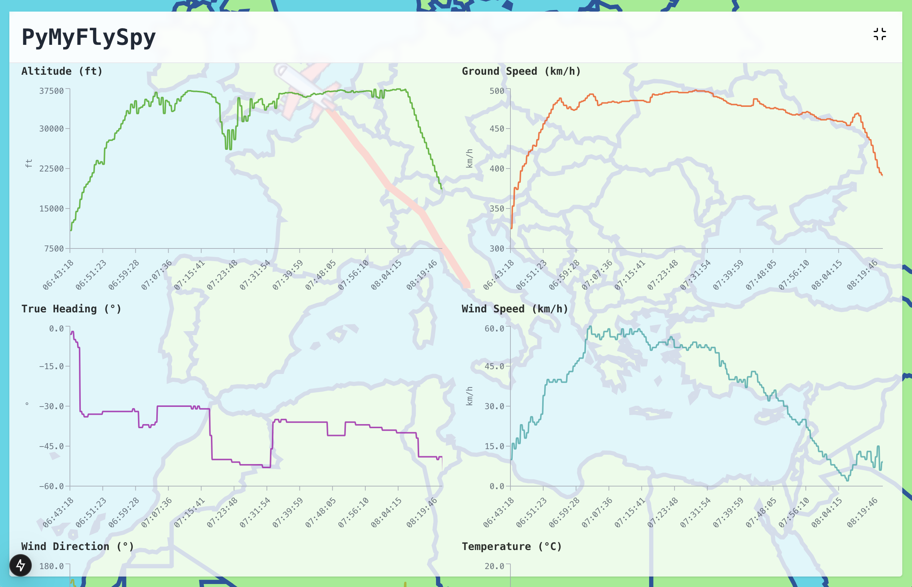
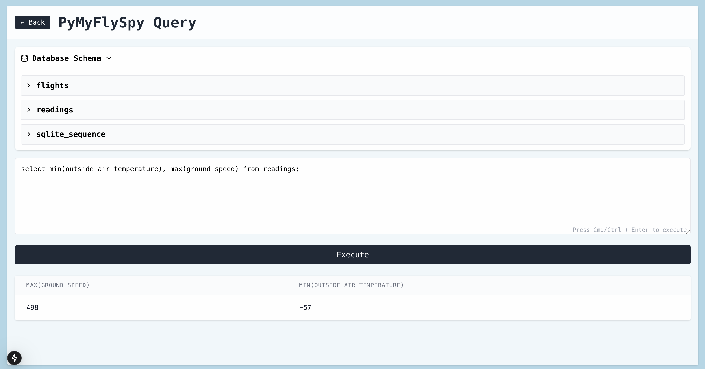

"Where are we daddy?" asked my five-year-old.
"We'll land in about an hour," I said.
"No I mean where are we? Are we flying over Italy yet?"

I wasn't sure. Our flight was short and cheap and the seats didn't have TV screens in the headrests. I looked around. I noticed a sticker encouraging me to connect to the in-flight wi-fi. That would do it, I thought. A site like [FlightRadar](https://www.flightradar24.com/) would answer my little man's question, down to the nearest few meters.

But unfortunately for him I'm the creator of [PySkyWiFi](https://robertheaton.com/pyskywifi/) ("completely free, unbelievably stupid wi-fi on long-haul flights"). Not paying for airplane internet is kind of my signature move. We'd need a different strategy.

# PyMyFlySpy

PyMyFlySpy is a local web app that displays handy maps and graphs about your flight. It does this using data from your in-flight TV and wi-fi login screen. [Read more in my blog post.](https://robertheaton.com/pymyflyspy)





## Installation

Install the backend and frontend using pip and yarn (or your preferred alternatives).

### Backend

```
cd ./backend
virtualenv venv
source venv/bin/activate
pip install -r requirements.txt
```

### Frontend

```
cd ./frontend
yarn install
```

## Running the demo

### Web server

In a terminal:

```
cd ./backend
source venv/bin/activate
python3 demo_data.py
python3 app.py
```

### Web frontend

In another terminal:

```
cd ./frontend
yarn dev
```

## Running for real

### Recorder

The data recorder is a Firefox extension. To use it:

* In `firefox-extension/background.js`, update the config with the webpage and endpoint for your flight's status page
* Go to `about://debugging` in Firefox and "Load temporary addon" to install the extension. 
* In `backend/app.py`, implement a function that parses this data into the format expected by the database. You can add new fields if you like. Note that you don't need to save latitude and longitude if you can't get them from the website - the app will calculate them dynamically for you, given your starting airport. Register it so that you can choose it when you pass `--airline YOUR_AIRLINE` to `app.py`.


### Web server

In a terminal, run:

```
cd ./backend
source venv/bin/activate
python3 app.py --airline YOUR_AIRLINE
```

### Web frontend

In a second terminal, run:

```
cd ./frontend
yarn dev
```

Then visit http://localhost:3000. You should see your flight!

[Read more in my blog post.](https://robertheaton.com/pymyflyspy)

## Disclaimer

PyMyFlySpy is an educational tool that only accesses publicly available data that airlines already send to every passenger's device. It:

- Doesn't interact directly with any aircraft systems
- Doesn't make any requests to airline servers
- Doesn't bypass any security measures or paywalls
- Only passively reads data that is intentionally made public
- Doesn't store or transmit sensitive information

Users should:
- Check their airline's terms of service before use
- Use this tool for educational purposes only
